# Ratune

A terminal music player for Subsonic-compatible servers.
Built in Rust with [Ratatui](https://github.com/ratatui/ratatui), featuring  album art graphics (including in tmux), gapless playback, fuzzy finder support, and a highly configurable UI.

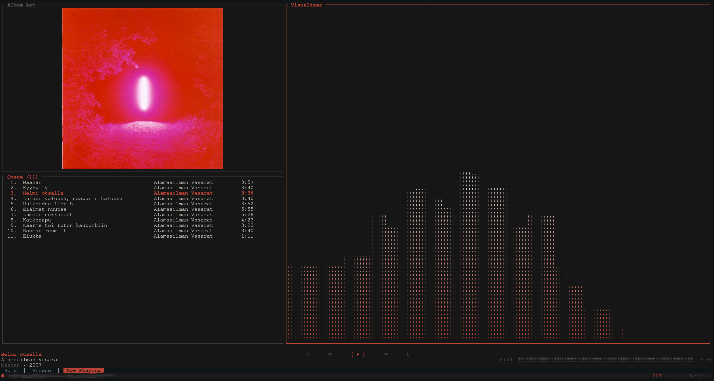

**Why Ratune?**

Ratune was built to bring together a combination of features often missing from Subsonic players: fuzzy navigation, a visually rich UI with album art, deep customization, and a fully terminal-based workflow. Many players excel at a few of these. Ratune aims to cover them all.

---

## Table of contents

- [Highlights](#highlights)
- [Screenshots](#screenshots)
- [Requirements](#requirements)
- [Installation](#installation)
- [Configuration](#configuration)
- [Default keybinds](#default-keybinds)
- [tmux](#tmux)
- [Project layout](#project-layout)
- [Data on disk](#data-on-disk)
- [Credits](#credits)
- [Acknowledgements](#acknowledgements)
- [License](#license)

---

## Highlights

- **Playback**: Gapless queue, seek, shuffle/unshuffle, and playlist management.
- **Album Art**: Display using Kitty graphics and [ratatui-image](https://github.com/ratatui/ratatui-image) (see link for compatible terminals)
- **Lyrics**: Synced lyrics via LRCLib when available.
- **Visualizer**: FFT spectrum analyzer.
- **Fuzzy finder**: Optional library index + external picker (fzf/skim) for fast track selection.
- **Customization**: Keybinds, theme, layout, now-playing lines, queue row template inspired by ncmpcpp.
- **Integration**: Linux MPRIS (media keys, `playerctl`).

---

## Requirements

- **Rust**: Stable toolchain (for building from source, and `cargo install` when published).
- **Server**: A Subsonic-compatible music server (Navidrome is a good default).
- **Fzf**: `fzf` or `sk` on `PATH` if you use the library picker (see `[library]` in the sample config).
- **Linux**: `libasound2-dev` / `alsa-lib` development packages for the audio stack.

---

## Installation

**Linux (and similar):** install ALSA dev headers *before* the first `cargo build`:

```bash
# Debian / Ubuntu
sudo apt install libasound2-dev pkg-config

# Fedora / RHEL
sudo dnf install alsa-lib-devel pkg-config

# Arch
sudo pacman -S alsa-lib
```

**From source** (recommended for now):

```sh
git clone https://github.com/acmagn/ratune.git
cd ratune
cargo build --release
```

The binary is `target/release/ratune`.

**When published to crates.io:**

```sh
cargo install ratune
```

**Album art in the terminal:** from a source checkout you can run a small [ratatui-image](https://github.com/ratatui/ratatui-image) harness (same capability query as the real UI) to verify your terminal or tmux passthrough before chasing bugs in the full app. Use any JPEG/PNG (etc.) on disk:

```sh
# Cargo workspace root (this repo layout)
cargo run -p ratune --example art_image_test -- /path/to/cover.jpg

# Or from the ratune/ crate directory only
cargo run --example art_image_test -- /path/to/cover.jpg
```

Press `q` or Esc to exit.

---

## Configuration

On first start, ratune creates a short default file at `~/.config/ratune/config.toml` (server fields plus common UI defaults). For every key with comments, use the sample file and copy the sections you need: [`docs/sample-config.toml`](docs/sample-config.toml).

Minimum: set Subsonic URL and credentials:

```toml
[server]
url = "https://your-navidrome.example.com"
username = "you"
password = "your_password"
```

### Environment overrides (optional)

Takes priority over the file if set:

```sh
export SUBSONIC_URL="https://your-server.example.com"
export SUBSONIC_USER="admin"
export SUBSONIC_PASS="your_password"
```

`TERMUSIC_SUBSONIC_*` variants are also accepted (see sample config).

### Snippets: player, cache, theme, fzf

```toml
[player]
default_volume = 70
max_bit_rate = 0

[cache]
enabled = true
max_size_gb = 2

[ui]
# Only `album_art_backend` lives here; NP strip/queue/toggles → `[ui.nptab]`, `[ui.row_now_playing]`, …

[theme]
preset = "dynamic"

[library]
# enabled, index path, fzf binary, fzf args, …  → see sample-config.toml
```

Remapping is done in `[keybinds]`; colors in `[theme]`; now-playing strip vs queue are different keys — see the sample and in-app help (`i`).

---

## Default keybinds

These are defaults; everything is overridable in `config.toml`. Press `i` in the app for the list that matches your file.

| Key | Action |
| --- | --- |
| `1` / `2` / `3` | Home / Browse / Now playing |
| `Tab` | Next tab (wrap) |
| `j` / `k` | Move selection |
| `h` / `l` | Columns / home album strip |
| `Enter` | Open / play |
| `a` / `A` | Add track / add all |
| `p` / `Space` | Play / pause |
| `n` / `N` | Next / previous |
| `x` / `z` | Shuffle / unshuffle |
| `+` / `-` | Volume |
| `←` / `→` | Seek (Now playing) |
| `/` | Search |
| `L` | Lyrics |
| `V` | Visualizer |
| `P` | Playlist overlay (Browse) |
| `>` | Add to playlist (Browse) |
| `Ctrl+f` | Library fzf picker (if configured) |
| `t` | Toggle dynamic theme |
| `i` | Help |
| `q` | Quit |

---

## Screenshots


### Main UI

<p align="center">
  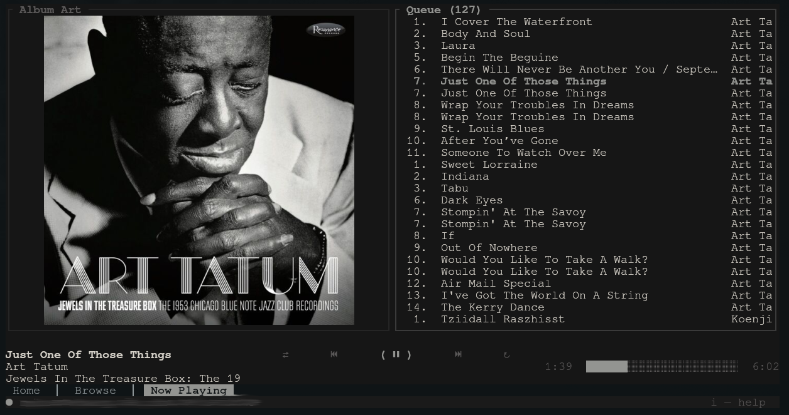
  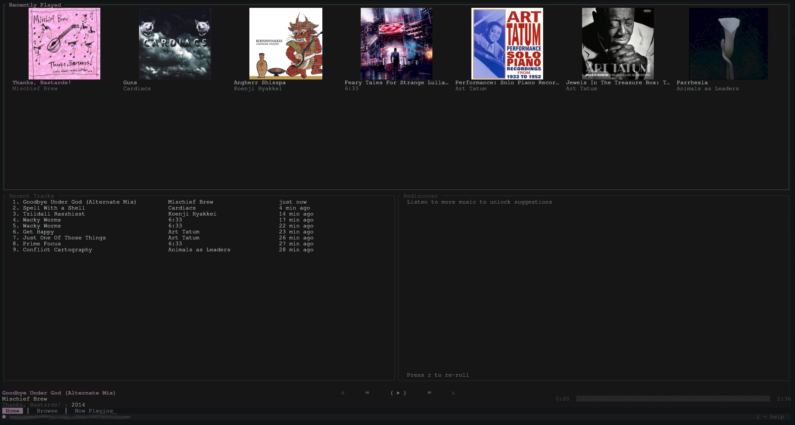
</p>
<p align="center">
  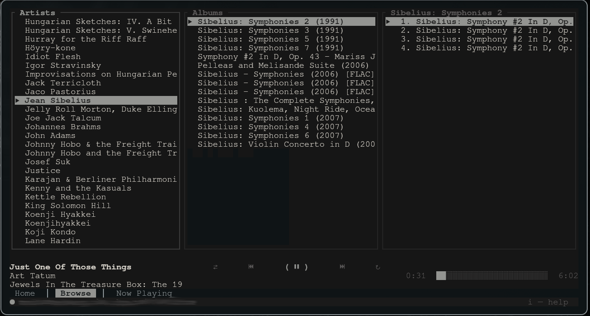
  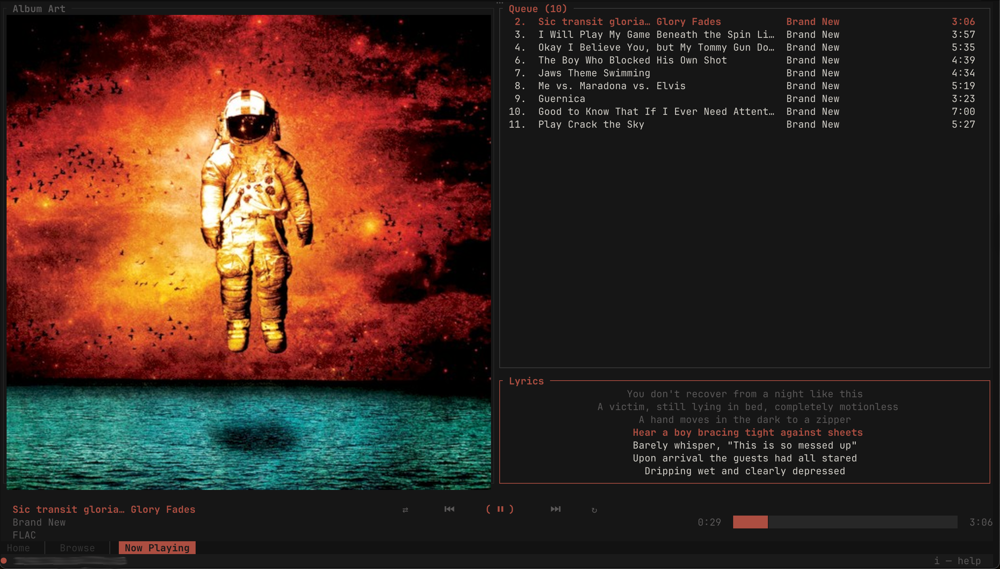
</p>
<p align="center">
  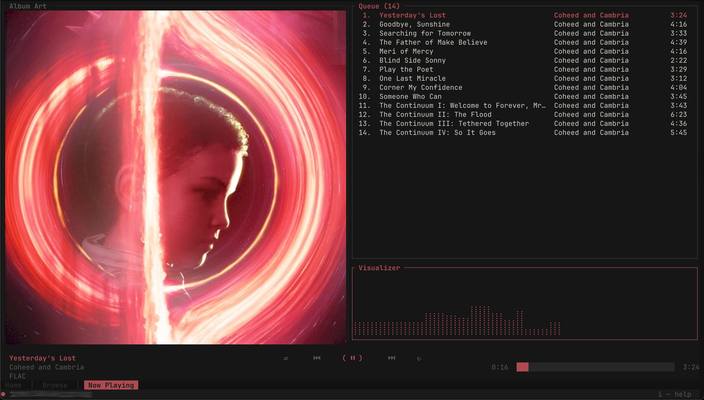
  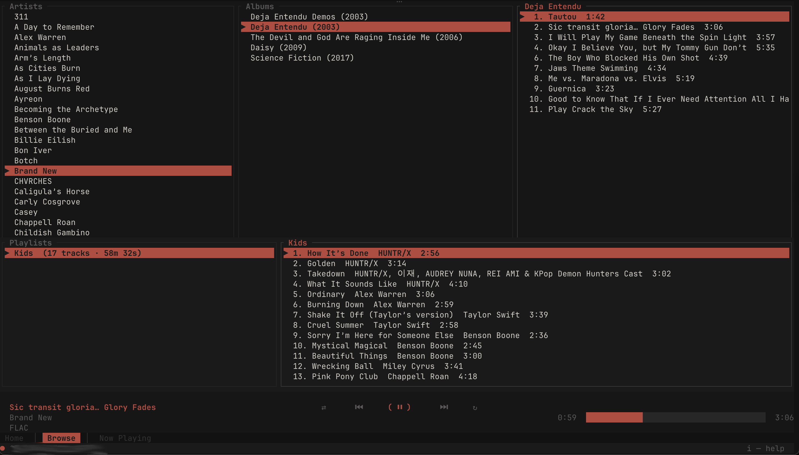
</p>
<p align="center">
  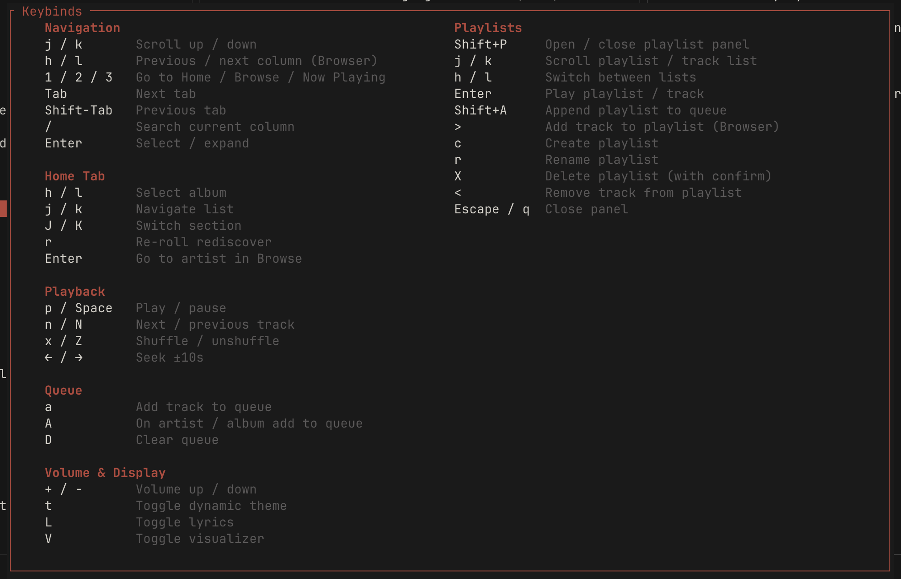
</p>

### Fuzzy finder

Full-library fzf (or sk) flow.

**Library metadata required for fuzzy finding to work properly.** Enable it and configure refresh/arguments under `[library]` in [`docs/sample-config.toml`](docs/sample-config.toml).

<p align="center">
  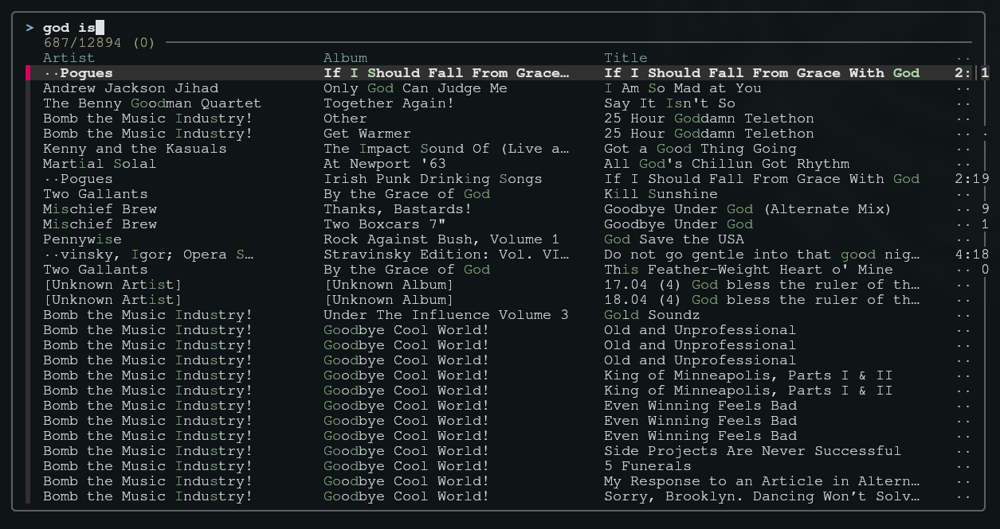
</p>

### Customization

Theme, layout, now-playing lines, queue row template, tab bar, and more are configured in `config.toml` (see the sample config).


<p align="center">
  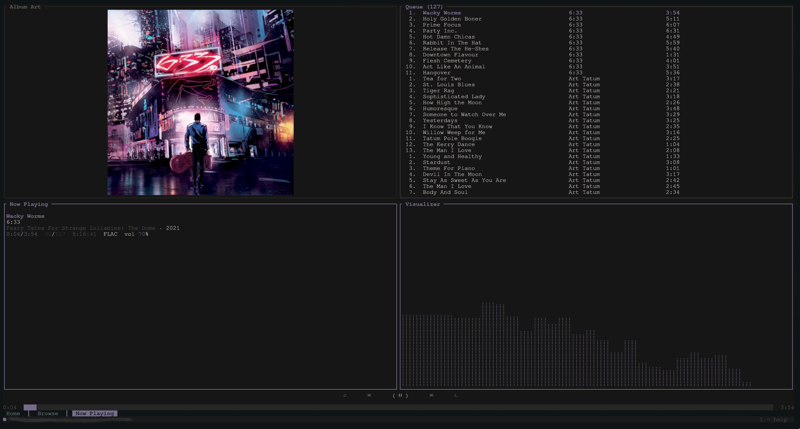
</p>

Album art, fzf, and visualizer features can be disabled for those desiring a minimalist experience:

<p align="center">
  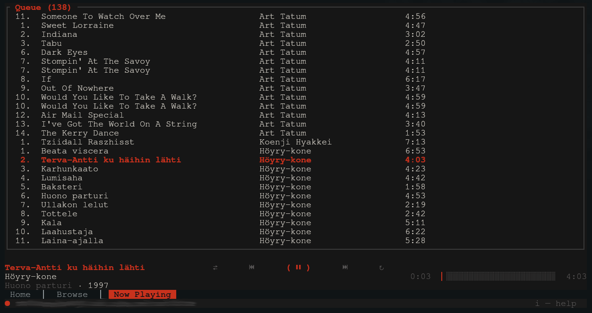
  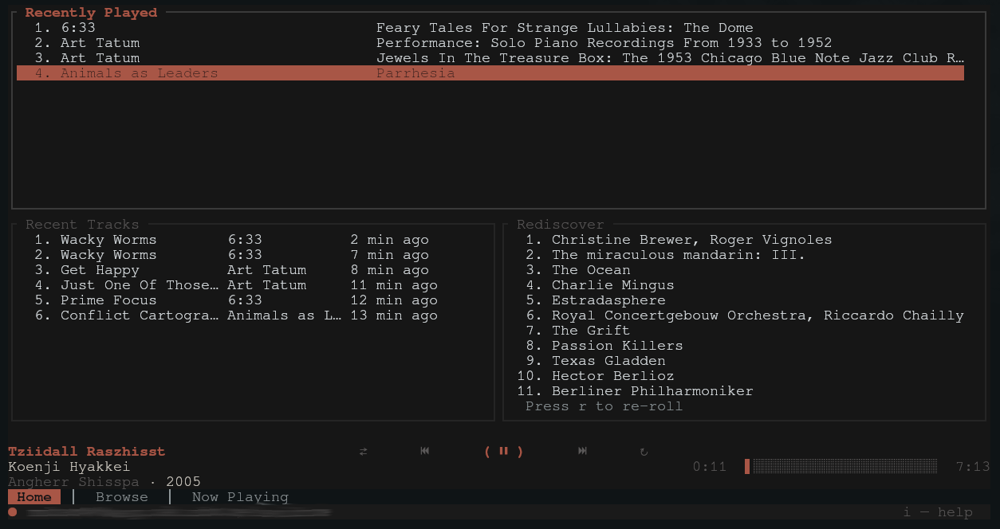
</p>

---

## tmux

For album art and focus events inside tmux:

```tmux
set -g allow-passthrough on
set -g focus-events on
```

---

## Project layout

This repository is a Cargo workspace with three crates:

| Crate | Role |
| --- | --- |
| [`ratune`](ratune/) | TUI, event loop, state, art, fzf, MPRIS |
| [`ratune-subsonic`](ratune-subsonic/) | Subsonic HTTP client and models |
| [`ratune-player`](ratune-player/) | Audio (rodio), gapless, sample tap for the visualizer |

Details: [`docs/ARCHITECTURE.md`](docs/ARCHITECTURE.md).

---

## Data on disk

| Path | Purpose |
| --- | --- |
| `~/.config/ratune/config.toml` | Config |
| `~/.config/ratune/state.json` | UI state, queue, browser position |
| `~/.local/share/ratune/history.json` | Play history |
| `~/.cache/ratune/` | Track cache, library index JSON, etc. |

---

## Credits

Ratune is based on [playterm](https://github.com/awriterandtheword-rgb/playterm-app) by [awriterandtheword-rgb](https://github.com/awriterandtheword-rgb) (MIT). The original project is licensed under MIT and served as the foundation for this work. Ratune has since diverged significantly with new features, performance improvements, and UI changes.

---

## Acknowledgements

- [ratatui](https://github.com/ratatui/ratatui) — TUI
- [rodio](https://github.com/RustAudio/rodio) — playback
- [Navidrome](https://www.navidrome.org/) — test target server
- [LRCLib](https://lrclib.net) — lyrics
- [rmpc](https://github.com/mierak/rmpc) — ideas for navigation and art

## License

[MIT](https://opensource.org/licenses/MIT)
